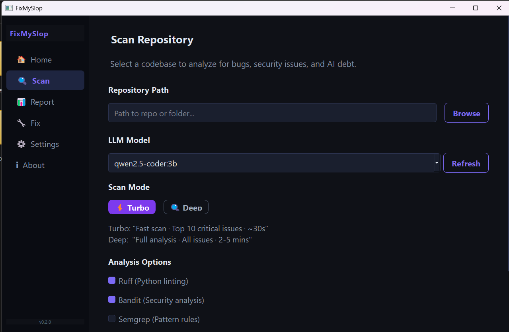
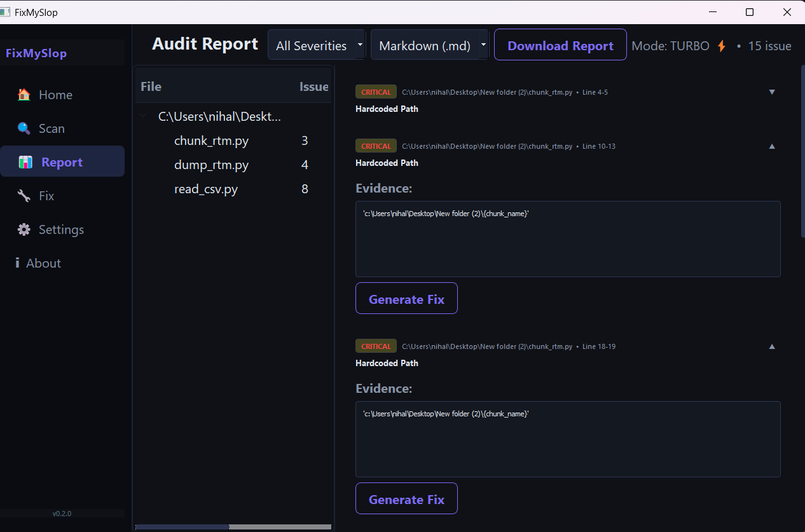
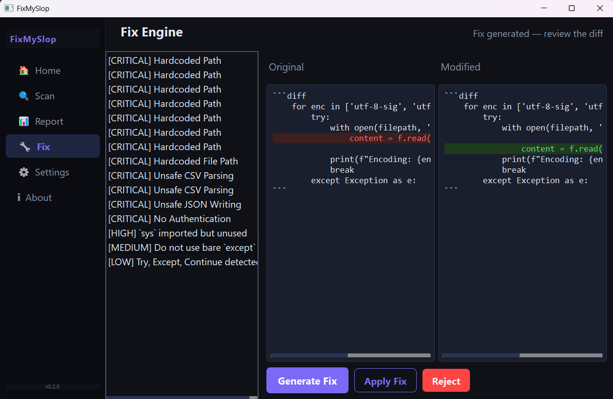
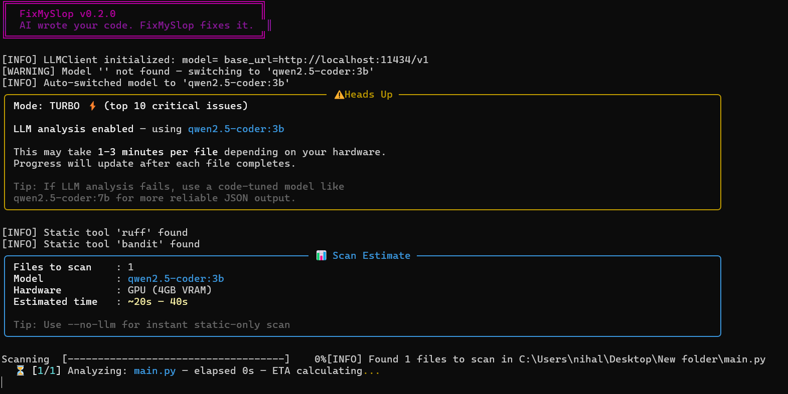

# FixMySlop

[](LICENSE)
[](https://python.org)
[]()
[](https://github.com/MrSpideyNihal/FixMySlop/stargazers)

> **FixMySlop — The free, 100% local AI-powered code janitor that finds and fixes bugs, security holes, and AI slop in your projects. No cloud, no API keys, no BS.**

- Cleans messy AI-generated code (hallucinations, bad patterns, weak security)
- Gives a clear Slop Score, detailed audit report, and one-click fix generation
- Works offline with Ollama, llama.cpp, or vLLM so your code stays private

---

## Visual Tour






### Screenshot Guide

| Screenshot File | What It Shows |
|-----------------|---------------|
| `screenshots/Search.png` | Scan setup flow (project selection + scan controls) |
| `screenshots/report1.png` | Report view with issue list and quality insights |
| `screenshots/fix.png` | Fix workflow and diff-style patch review |
| `screenshots/cli.png` | CLI scan output for terminal-first users |

---

## Features

- ⚡ Turbo + Deep scan modes for speed vs depth
- 🔍 Full repository scanning with `.gitignore` awareness
- 🛡️ Security checks (Bandit + LLM context analysis)
- 🧹 AI smell detection (hallucinated imports, weak validation, broad exception handling)
- 📊 Slop Score (0-100) to summarize code health
- 🔧 LLM-powered fix generation with unified diffs
- 📄 Report export in Markdown, HTML, JSON, CSV, and PDF
- 🎨 Polished PyQt5 desktop GUI with dark/light themes
- 💻 Full CLI for automation and CI-friendly usage
- 🤖 Auto model fallback when configured model is missing
- 🪟 Windows-safe terminal output handling
- 🏠 100% local-first architecture

---

## Why FixMySlop?

FixMySlop combines static analysis + LLM reasoning + local privacy in one workflow.

| Compared To | Typical Limitation | FixMySlop Advantage |
|-------------|--------------------|---------------------|
| Ruff/Pylint-only workflows | Strong syntax/style checks, limited semantic AI context | Adds LLM-based deep reasoning on top of static tools |
| Cloud AI code reviewers | Code leaves your machine, subscription cost | 100% local and private |
| IDE-only assistants | Great inline help, weaker full-repo audit/report flow | Full-repo scans, report panel, Slop Score, fix workflow |

---

## Installation

### Prerequisites

- Python 3.10+
- A local OpenAI-compatible backend (Ollama recommended): https://ollama.ai

### Quick Start

```bash
# Clone
git clone https://github.com/MrSpideyNihal/FixMySlop.git
cd FixMySlop

# Install dependencies
pip install -r requirements.txt

# Pull a local model (example)
ollama pull qwen2.5-coder:3b

# Launch GUI
python main.py

# Or run CLI
python main.py scan ./your-project --mode turbo
```

FixMySlop can auto-detect an available model, so manual model config is optional.

### Optional Static Tools

```bash
pip install ruff bandit
pip install semgrep
```

### Troubleshooting

- Backend not reachable: run `ollama serve` first
- Model not found: run `ollama pull qwen2.5-coder:7b` (or another installed coder model)
- Windows terminal shows garbled Unicode: switch to UTF-8 code page (`chcp 65001`) or use Windows Terminal/CMD

---

## Usage

### GUI

```bash
python main.py
```

Main sections:
- Home
- Scan
- Report
- Fix
- Settings

### CLI Recipes

```bash
# Quick scan
python main.py scan ./myproject

# Turbo mode (fast top issues)
python main.py scan ./myproject --mode turbo

# Deep mode (full pass)
python main.py scan ./myproject --mode deep

# Deep static-only
python main.py scan ./backend --mode deep --no-llm --output json

# Save report
python main.py scan ./myproject --save slop-report.md --output markdown

# Use explicit model
python main.py scan ./myproject --model qwen2.5-coder:3b --mode turbo

# List backend models
python main.py models
```

### Scan Modes

| Mode | Focus | Typical per-file estimate |
|------|-------|---------------------------|
| `turbo` | Prioritize high-impact findings quickly | `~20-40s per file` |
| `deep` | Broader and more exhaustive finding coverage | `~15-30s per file` |
| `--no-llm` | Static analysis only | `< 1s per file` |

---

## Configuration

Config file path: `~/.fixmyslop/config.yaml`

```yaml
model: ""
base_url: http://localhost:11434/v1
api_key: ollama
temperature: 0.2
theme: dark
font_size: 14
use_ruff: true
use_bandit: true
use_semgrep: false
auto_backup: true
```

If `model` is empty, FixMySlop auto-selects the best available model from your running local backend.

---

## Supported Languages

Python, JavaScript, TypeScript, Go, Rust, Java, C++, C, C#, Ruby, PHP, Swift, Kotlin

---

## Architecture

```text
FixMySlop/
├── macros.py
├── main.py
├── core/
│   ├── scanner.py
│   ├── analyzer.py
│   ├── llm_client.py
│   ├── fix_engine.py
│   └── ...
├── ui/
│   ├── panels/
│   ├── widgets/
│   └── assets/
├── cli/
├── utils/
└── tests/
```

Design rules:
- `core/` never imports `ui/`
- Constants are centralized in `macros.py`
- Heavy work runs in `QThread`
- Path handling uses `pathlib.Path`

---

## Running Tests

```bash
pytest tests/ -v
```

---

## Contributing

Contributions are welcome.

1. Open an issue for bugs or feature ideas
2. Fork and create a branch
3. Add tests for behavior changes
4. Run `pytest tests/ -q`
5. Open a PR with a clear summary

---

## Roadmap

- More language-specific rules and higher-quality fix templates
- Better safe auto-apply for low-risk fixes
- Pre-commit and CI integration helpers
- Optional richer report visualizations

---

## Acknowledgments

- Ollama
- llama.cpp
- vLLM
- Ruff
- Bandit
- Semgrep
- PyQt5
- fpdf2

---

## License

MIT — free forever and open source.

---

Loved this project? Please star the repo.


